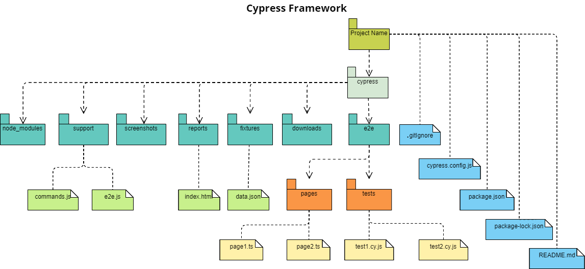

# Cypress Framework

*- This project is a base project to build a solid test automation framework using cypress test automation tool and javascript programming language.*

*- You can use this framework to be a start point for your test automation project to write your automated test cases.*

*- You can find more details in cypress official website documentation:*
https://docs.cypress.io/guides/overview/why-cypress

## `Preparation:`

### A. Pre-requirements:

#### 1- Download and install latest nodejs through the below link
https://nodejs.org/en/download
        
#### 2- Download and install visual studo code throw the below link
https://code.visualstudio.com/download

### B. Project readiness

#### 1- Clone the project

#### 2- Run the below command to install the required dependancies

        npm install

## `Contents:`

### A. Folders and directories:

#### 1- e2e/tests/:
* All test cases scripts

#### 2- e2e/pages/:
* All pages

#### 3- fixtures/:
* All test data files with different types (json format, csv and excel sheets)

#### 4- downloads/:
* contains downloaded files

#### 5- reports/:
* Generated reports

#### 6- node_modules/:
* All downloaded libraries and modules

#### 7- support/:
* General framework commands

#### 8- screenshots/:
* Generated screenshots

### B. Project configuration files:

#### 1- cypress.config.js: 
* Default configuration file

#### 2- package.json:
* Project properities
* Scripts and keywords
* Installed dependencies

#### 3- package-lock.json:
* Detailed Installed dependencies

#### 4- .gitignore:
* All files and folders that needs to be excluded from pushing to the version control

## `How to run?`

### A. Running normal test cases:

#### 1- Use direct command as below:

        npx cypress run

#### 2- Other way:

        npx cypress open

* Choose the target test file

## `Project Structure:`
*The below is a package diagram for the implemented project structure "Files and folders"*

